# taskmaster
This repository is going to hold my Android tasks provided by ASAC team 

## Version 1 : lab 26 - Beginning TaskMaster

For this lab I created a home page with a text , picture and two buttons :
- one leads me to add task page which enables me to add a task with title and body and gives me a response message when I click on add task button (this page doesn't save the task to the database yet).
- second button leads me to all tasks page that only has an image for now.

Pages other than the home page have a back home arrow in the header.

## Version 2 : lab 27 - Data in TaskMaster

In this lab I learnt how to deal with data , I added four buttons for the home page :
- Three buttons for hard coded tasks leading me to taskDetails activity.
  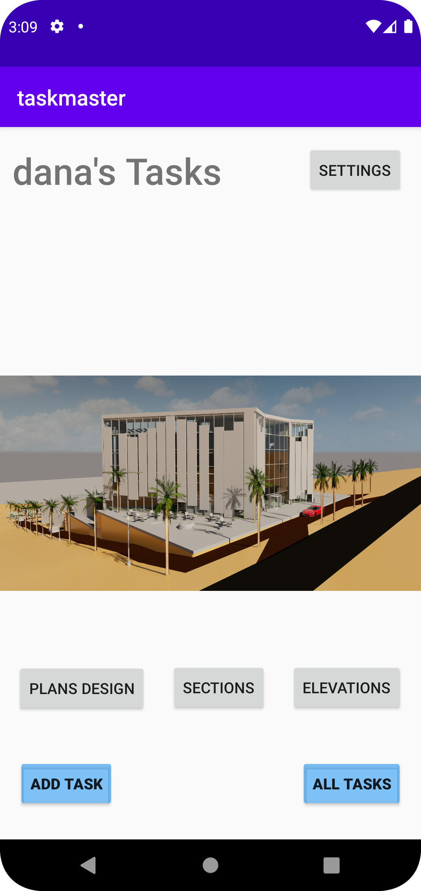
  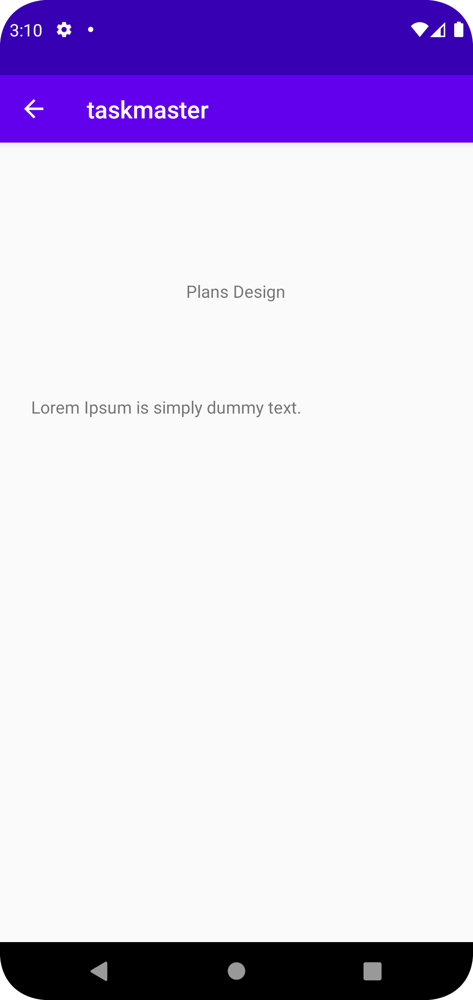

- Button number four takes me to the settings activity where you can set your username and you will have your username rendered on the home page.
  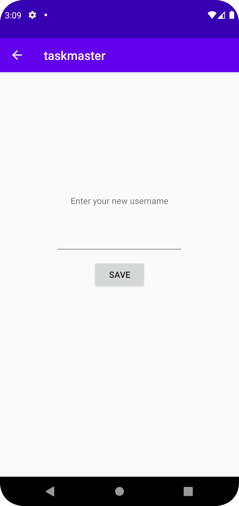

## Version 3 : lab 28 - RecyclerView 

In this lab I learnt how to display a recyclerView and send its data to the next activity. 
For this lab I created a task class, deleted my three tasks buttons and created a recyclerView instead that sends all the task data to the taskDetails activity.
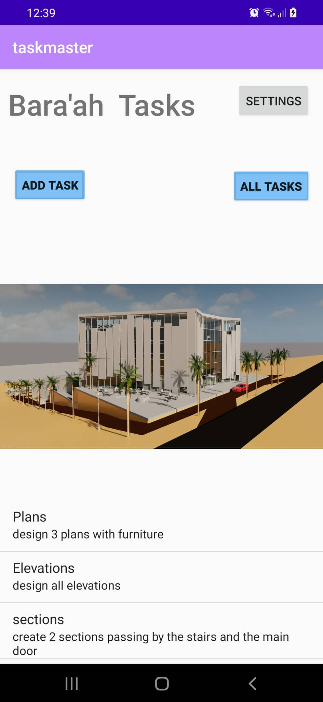
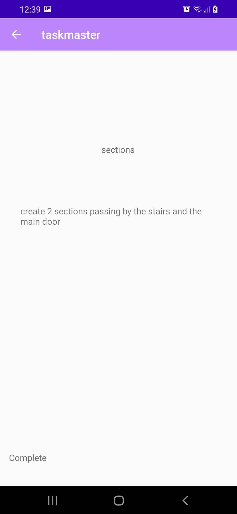
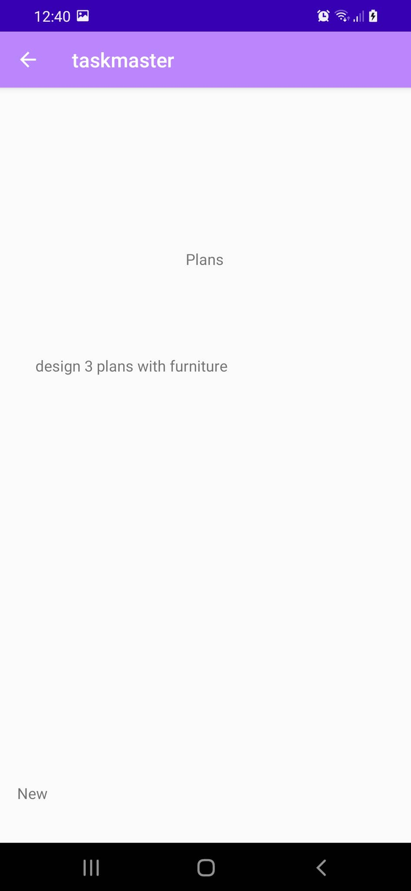

In addition to that I added a spinner in the addTask activity for setting the task state.
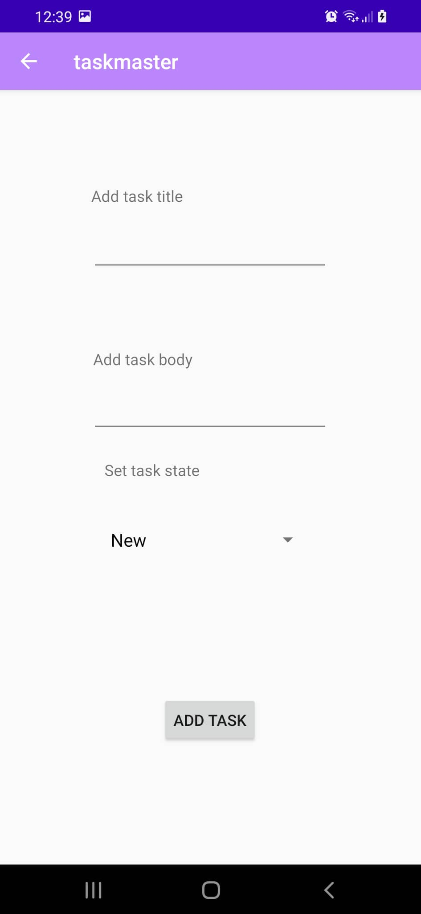
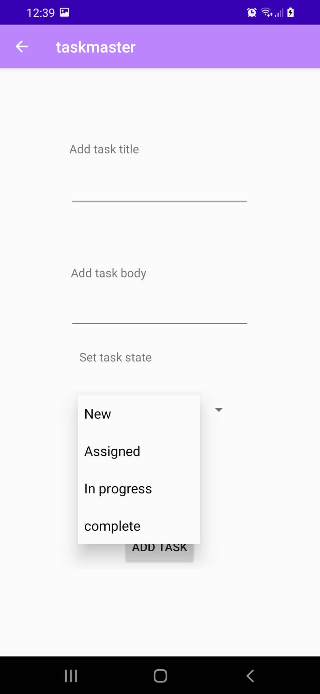

## Version 4 : lab 29 - Room 
For this lab I learnt how to create a database with Room and how to add an entity to it and how to deal with them using DAO.  
In this version I created a database for my application so now I am able to take tasks from the user.
In addition to that I rendered these tasks from the database to the main activity page and I am able to send each task's data to te task details activity. 
Nothing changed visually so no need for screenshots for this version. 

## Version 5 : lab 31 - Espresso and Polish

For this lab I added UI tests for :
- Navigating to settings activity and changing the username 
- Rendering the username in the main activity 
- Navigating to add tasks activity and adding a task. 
  Nothing changed visually so no need for screenshots for this version. 
  
## Version 6 : lab 32 - Amplify and DynamoDB

In this lab I created an AWS account and installed the Amplify CLI and connected my application with amplify and DynamoDB to save my data in instead of Room.

## Version 7 : lab 33 - Related Data

For this lab I Created a second entity for a team, which has a name and a list of tasks. Updated my tasks to be owned by a team.
In the settings activity the user can specify the team he/she belongs to.  
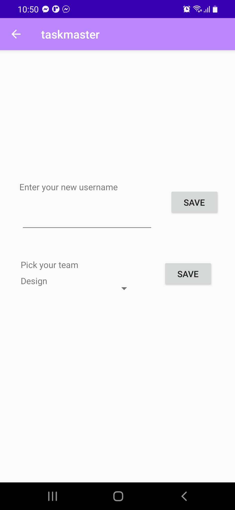  
So, in the main activity they will see only tasks that belong to their team. 
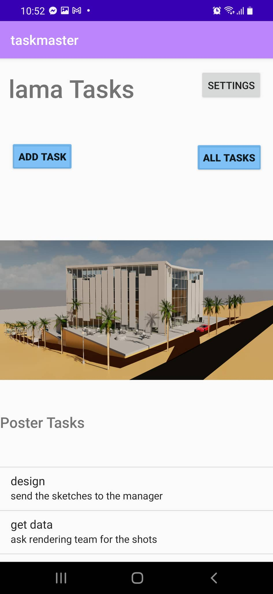  
In the addTask activity the user now have to specify what team the added task belongs to .   
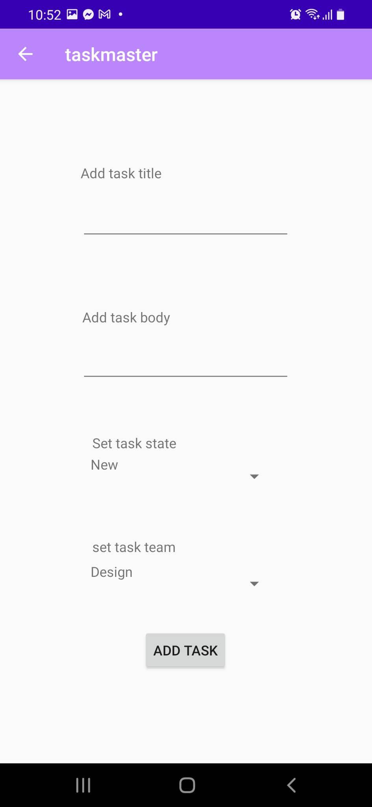 

## lab 34 - Publishing to the Play Store

### Google’s app publishing guide

Publishing your application is the act of making the application able to be installed and used from other users , **but how can we do that?**

#### Prepare the application for release
Preparing your application for release is a multi-step process that involves the following tasks:

1. Configuring your application for release.
2. Building and signing a release version of your application.
3. Testing the release version of your application.
4. Updating application resources for release.

5. Preparing remote servers and services that your application depends on.

You may have to perform several other tasks as part of the preparation process. see [Preparing for Release](https://developer.android.com/studio/publish/preparing) in the Dev Guide.  
When you are finished preparing your application for release you will have a signed .apk file that you can distribute to users.
#### Release the application to users
You can release your application to users in several ways such as : send it directly to a user release it in a/your website or you can release it through an application marketplace such as Google Play.
but **How?**

##### Releasing through an app marketplace
##### Releasing your apps on Google Play
1. Preparing promotional materials.
2. Configuring options and uploading assets.
3. Publishing the release version of your application.
#### Releasing through a website
1. prepare your application for release in the normal way.
2. host the release-ready APK file on your website and provide a download link to users.

the installation process will start automatically only if the user has configured their Settings to allow the installation of apps from unknown sources  which has couple disadvantages,such as :
1. You will not be able to use Google Play's In-app Billing service to sell in-app products.
2. You will not be able to use the Licensing service to help prevent unauthorized installation and use of your application.

#### User opt-in for unknown apps and sources
- On devices running Android 8.0 (API level 26) and higher :  users must navigate to the *Install unknown apps system settings* screen to *enable app installations from a particular source*.

- On devices running Android 7.1.1 (API level 25) and lower : users must either enable the *Unknown sources system setting* or allow a *single installation of an unknown app.*

## Version 8 : lab 36 - Cognito

In this lab I allowed users to sign up , log in and log out using Cognito.
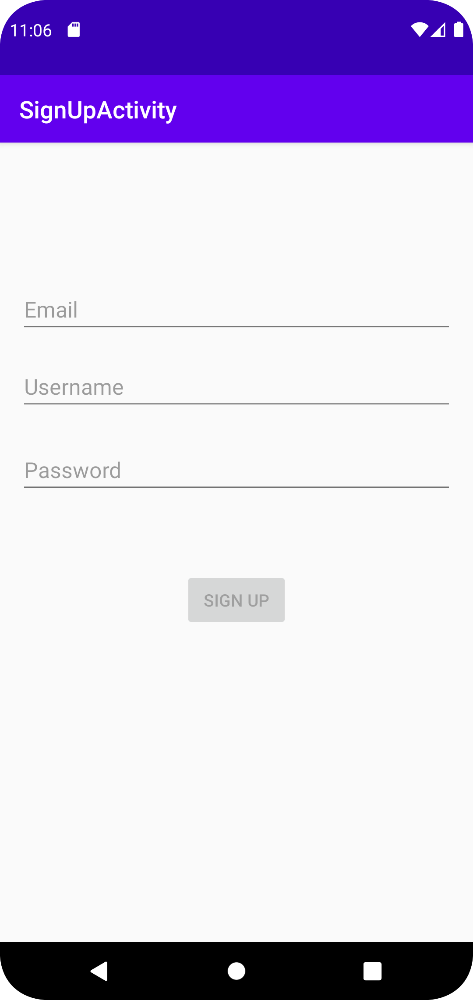
After signing up the user will receive a verification code to his email and will be navigated to verification page.  
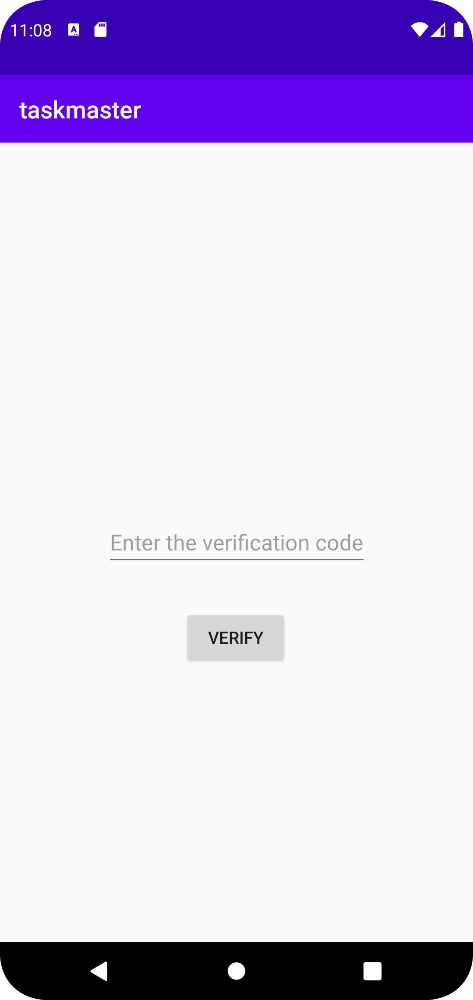

After verifying the email address the user will be navigated to the sign in page to sign in using their username and password.
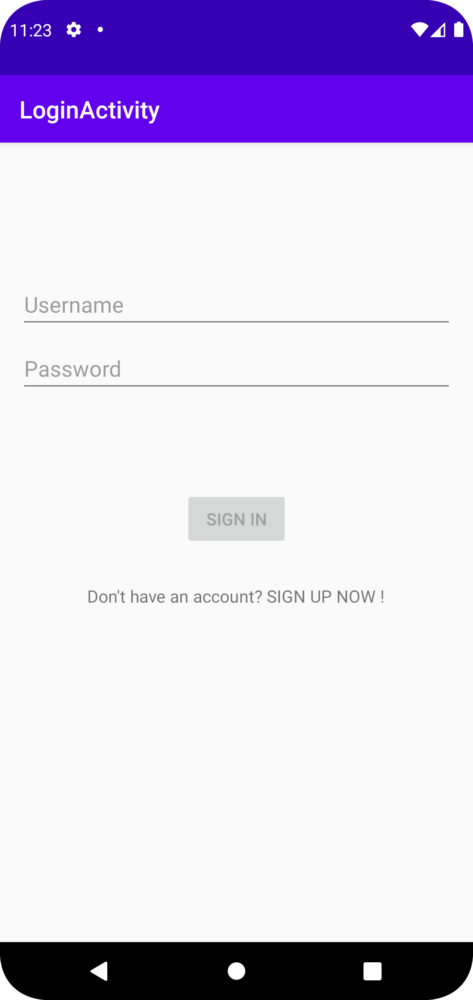
I also added Log out button in the menu in the navigation bar .
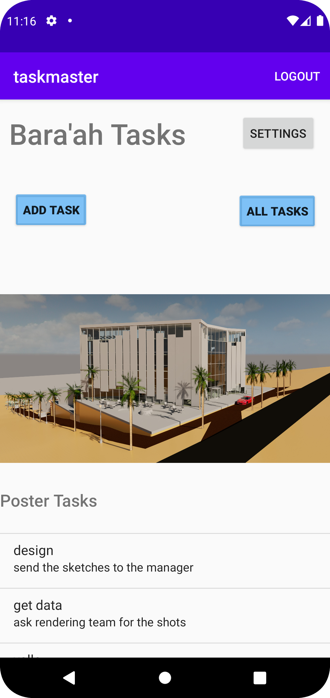

## Version 9 : lab 37 - S3 

In this version the user is able to upload an image to his tasks from his device using S3 .
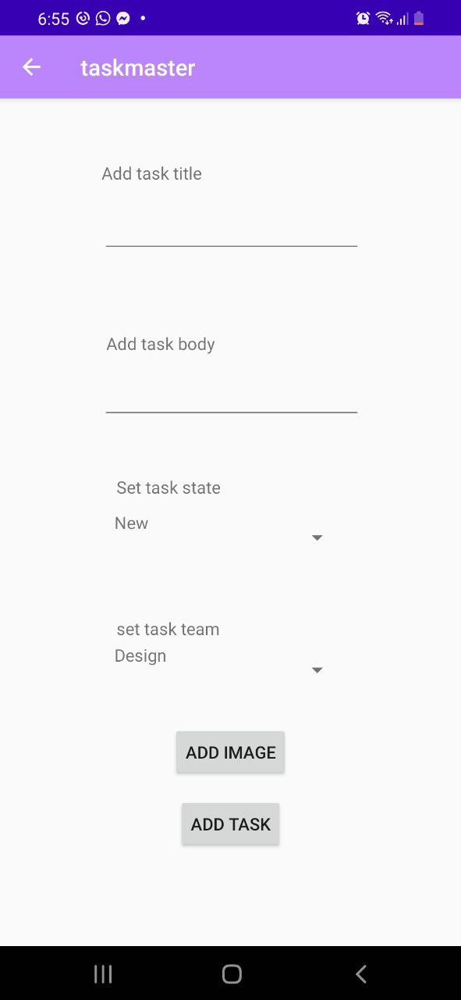
And the user is able to see that image in the task's details activity. 
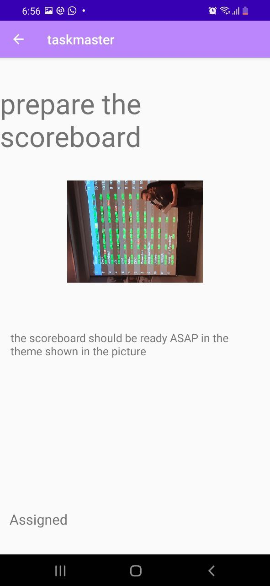

## Version 10 : lab 41 - Intent Filters

In this lab the user is able to translate the task's body from English to Arabic and is able to hear it (text is converted to to speech) all that using  Amplify Predictions library.
-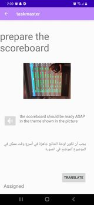
In addition to that we are abe to analyse user experience inside our application using Amazon Pinpoint.
-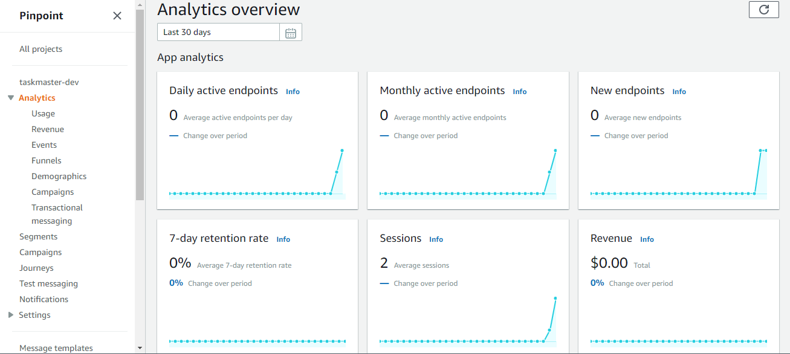

## Version 11 : lab 38 - Notifications

In this version our application allows users to “share” a photo from another application and open TaskMaster, ready to upload that image as part of a new task.
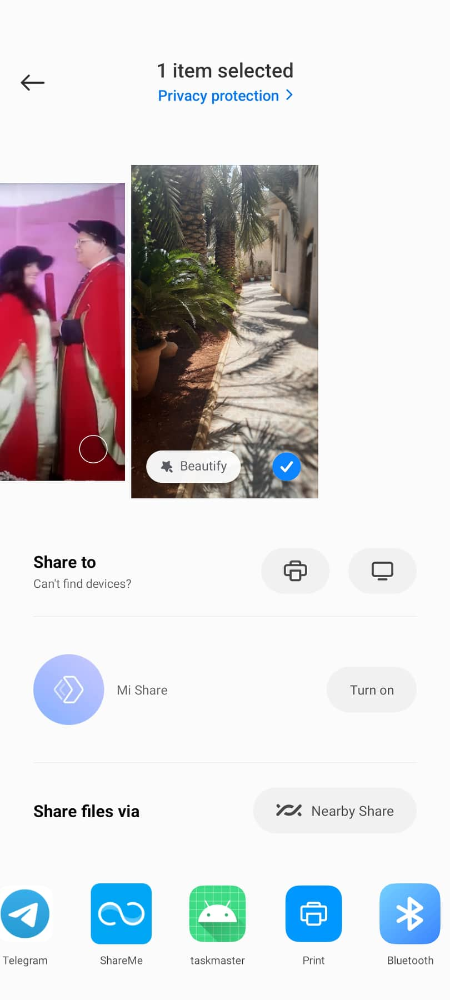
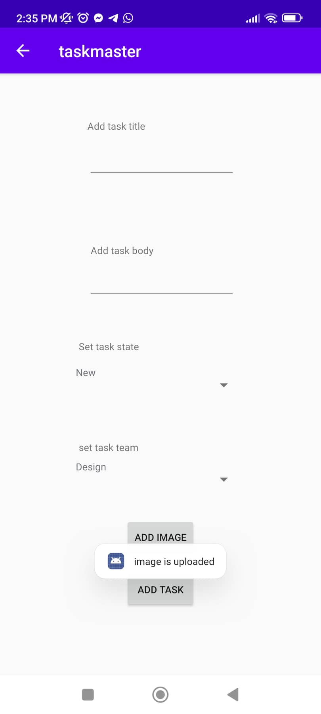
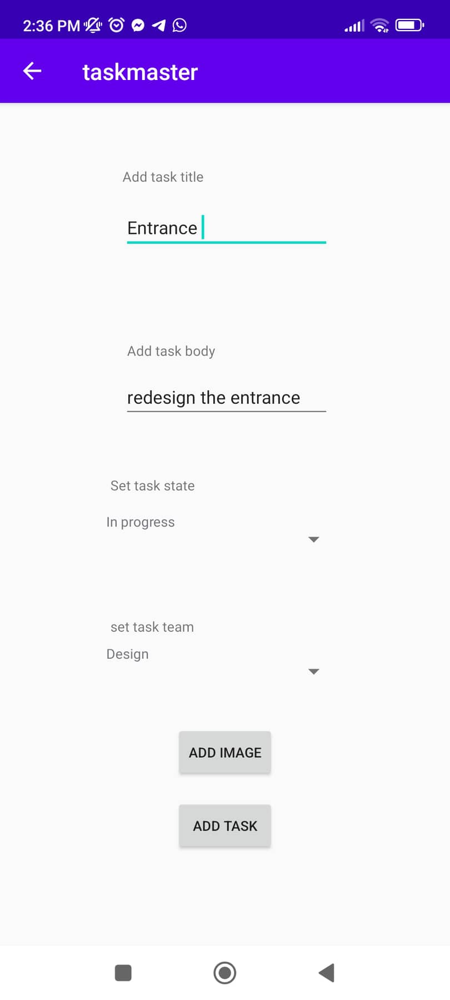
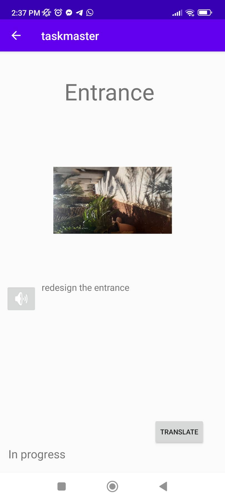

## Version 13 : lab 42 - Monetization And AdMob Ads

For this lab , my app is integrating a few different kinds of ads via Google AdMob.
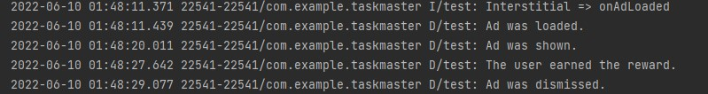
- Banner Ad 
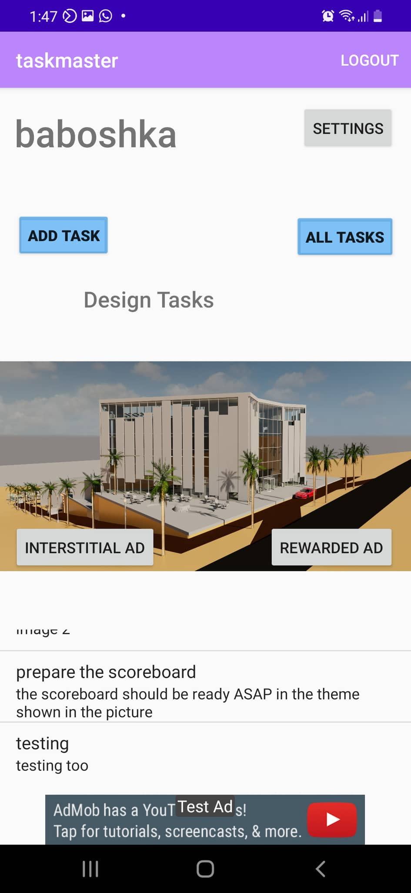
- Interstitial Ad
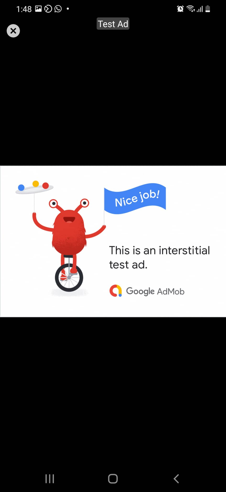
- Rewarded Ad
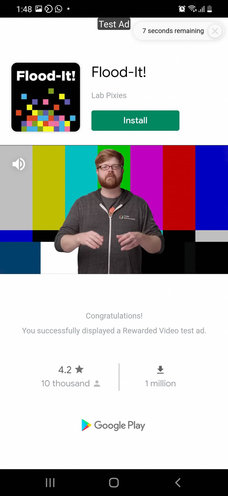
